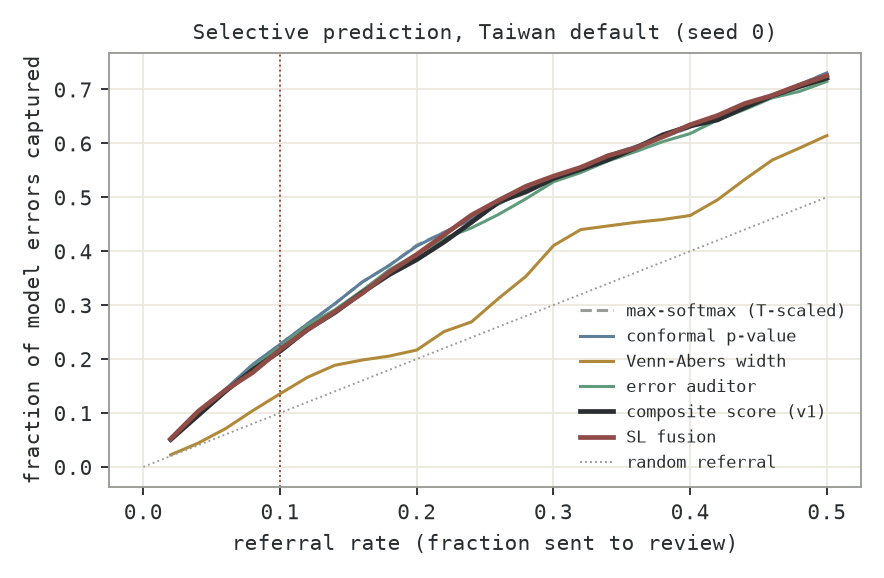
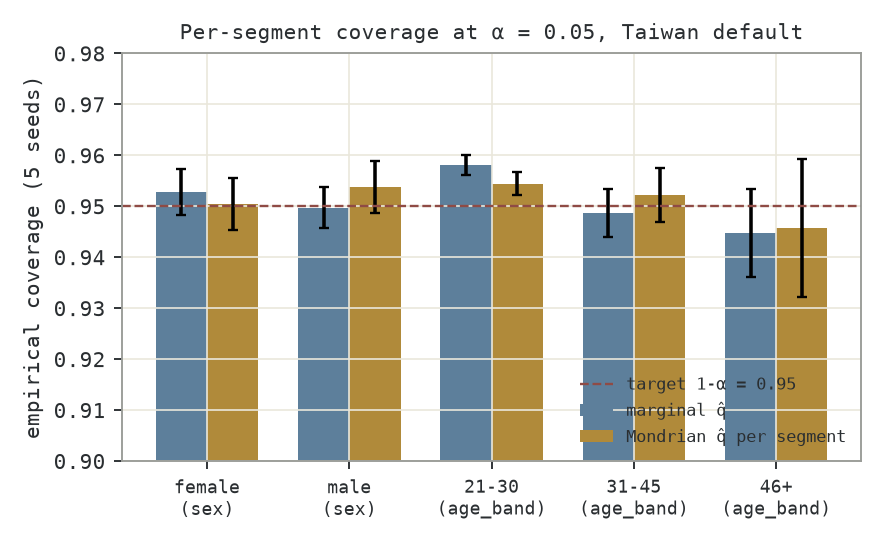
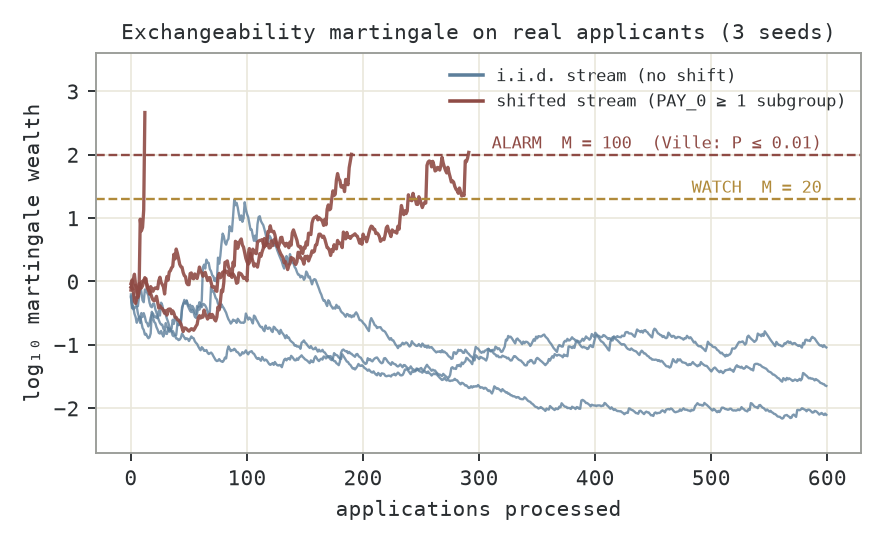
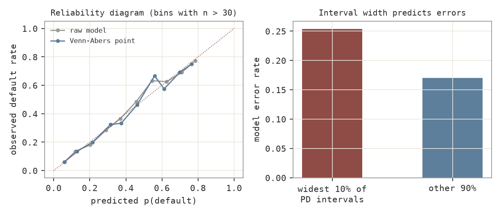

# Per-Decision Reliability Envelopes for Credit-Risk Models: An Evaluation on Real Data

**Ismael Ouattara, Sébastien Michel** · Reliax
Working paper v0.2, September 2026 (v0.2 adds the subjective-logic fusion signal). Code and data: `paper/` in the Reliax repository.

## Abstract

Credit-risk models execute high-consequence decisions whose failures are silent:
a wrong approval looks identical to a right one until the loss materialises. We
evaluate the Reliax *reliability envelope*, a per-decision bundle of a conformal
coverage certificate (marginal and per-segment), a Venn-Abers calibrated
probability-of-default (PD) interval, an error-auditor signal, and an
anytime-valid exchangeability test, on two real public credit datasets: the
Taiwan credit-card default dataset (30,000 applicants) and the German credit
dataset (1,000 applicants). Findings: (1) the conformal coverage guarantee is
verified empirically (0.9515 ± 0.0040 and 0.9532 ± 0.0167 at a 0.95 target);
(2) per-segment coverage audits on real sex and age attributes show only mild
segment deviations on these datasets, and the Mondrian repair is cost-free
insurance; (3) for selective prediction on in-distribution data,
confidence-based ranking is a strong baseline, while the error auditor gives
the best capture of wrong approvals (18.3% vs 17.2% at a 10% referral rate);
(4) Venn-Abers matches temperature scaling when the base model is already
calibrated and beats it clearly when it is not (ECE 0.065 vs 0.083 on German
credit, raw 0.186), and its interval width predicts model errors (error rate
0.229 in the widest decile vs 0.174 elsewhere); (5) the conformal test
martingale raises zero false alarms on 5 x 600 i.i.d. applications and detects
a real subpopulation shift in 4 of 5 streams within 600 applications; (6) a
subjective-logic fusion of the envelope's signals achieves the best
risk-coverage trade-off of all signals on the larger dataset (AURC 0.0955)
while clearly improving on the weighted-blend composite it replaces, though it
trails plain confidence on the small dataset; (7) the full envelope computes
in 8.0 ms median per decision. We state explicitly what
these results do not show: the pre-registered shifted-data benchmark that
motivates the uncertainty-aware signals remains future work.

---

## 1. Introduction

Production credit models fail three ways, all silently: confident errors on
individual applications, calibration decay when the economy shifts, and
segment-level unreliability hidden by aggregate metrics. Existing tooling
(aggregate monitoring, post-hoc explainability) does not answer the operational
question: *should this specific decision be acted on automatically, right now,
and can that be evidenced later?*

Reliax answers with a per-decision reliability envelope. This paper is a first
evaluation of its components on real data. It is deliberately small and
deliberately honest: every number below is produced by `eval/run_eval.py` and
stored in `results/results.json`; nothing is hand-typed without a source there.

## 2. The reliability envelope

For an application x with model output p(x), the envelope carries:

| Component | Construction | Guarantee class |
|---|---|---|
| Coverage certificate | Split conformal set Ĉ(x) at level α | Proven: P(Y ∈ Ĉ(X)) ≥ 1-α, distribution-free, finite-sample (Vovk et al., 2005) |
| Segment certificate | Mondrian conformal, one q̂ per audited segment | Proven per group: P(Y ∈ Ĉ(X) \| G=g) ≥ 1-α |
| PD interval [p0, p1] | Inductive Venn-Abers over calibration scores | Proven in the Venn sense: one of the two isotonic calibrators is perfectly calibrated (Vovk & Petej, 2014) |
| Drift verdict | Mixture power martingale on smoothed conformal p-values of a label-free nonconformity (kNN distance) | Proven, anytime-valid: P(sup M ≥ c) ≤ 1/c under exchangeability (Ville, 1939; Vovk et al., 2003) |
| Auditor | Meta-model trained on the base model's own calibration-split errors | Heuristic ranking signal |
| Composite score (v1) | 0-100 weighted blend with hard caps | Heuristic, labelled as such |
| Trust triple (SL fusion) | Subjective-logic averaging fusion of certificate-gated confidence, auditor and context opinions (Josang, 2016; PaTAS lineage) | Heuristic, calculus-backed |

Protected attributes are audit-only: the base model never receives them.

## 3. Experimental setup

**Datasets.** (a) *Taiwan*: Default of Credit Card Clients (Yeh & Lien, 2009;
UCI 350), 30,000 applicants, 22.1% default rate. SEX, AGE, MARRIAGE excluded
from the 20 model features; sex and age bands (21-30 / 31-45 / 46+) used for
audits. (b) *German*: Statlog German Credit (UCI 144), 1,000 applicants, 30%
bad rate, one-hot encoded to 56 features excluding sex/personal-status and age.
Provenance and licenses in `data/PROVENANCE.md`.

**Protocol.** Stratified 50/25/25 train/calibration/test split. Base model:
histogram gradient boosting (scikit-learn, 300 iterations). 5 seeds (Taiwan),
10 seeds (German); all tables report mean ± std over seeds. α = 0.05
throughout.

**Baselines and metrics.** Temperature scaling fitted on the calibration split
(Guo et al., 2017) for calibration comparisons; max-softmax probability (MSP)
ranking for selective prediction (T-scaling is monotone in the logit, so raw
and T-scaled MSP produce the same ranking). Metrics: empirical coverage;
per-segment coverage; error capture and wrong-approval capture at fixed
referral rates plus AURC (area under the risk-coverage curve, lower is
better); 15-bin ECE and Brier score; martingale false alarms and detection
delay; wall-clock latency. Ranking signals include (v0.2) the subjective-logic
fusion's expected value: each signal becomes an opinion (belief, disbelief,
uncertainty) and opinions merge by averaging fusion; the confidence source's
uncertainty is gated by the certificate (conformal p-value, set ambiguity,
interval width), and out-of-distribution inputs drive the context source
vacuous.

**Base model quality** (context): Taiwan accuracy 0.821 ± 0.001, AUC
0.777 ± 0.006; German accuracy 0.749 ± 0.021, AUC 0.769 ± 0.027. Both are
consistent with published results on these datasets.

## 4. Results

### 4.1 The coverage guarantee holds on real data (E1)

| Dataset | Target 1-α | Empirical coverage | Mean set size |
|---|---|---|---|
| Taiwan | 0.95 | **0.9515 ± 0.0040** | 1.49 |
| Taiwan | 0.90 | 0.8997 ± 0.0012 | - |
| German | 0.95 | **0.9532 ± 0.0167** | - |
| German | 0.90 | 0.8964 ± 0.0307 | - |

The certificate does what the theorem says, on real applicants, at both levels.
The mean set size of 1.49 on Taiwan is itself informative: at 95% confidence,
roughly half of real applications cannot be assigned a single outcome, which is
precisely the population a REVIEW route exists for.

### 4.2 Per-segment coverage and bias (E2)

Marginal coverage by real demographic segment (Taiwan, α = 0.05):

| Segment | n (test) | Marginal q̂ | Mondrian q̂ |
|---|---|---|---|
| female | 4,481 | 0.9527 ± 0.0045 | 0.9505 ± 0.0051 |
| male | 3,019 | 0.9497 ± 0.0040 | 0.9538 ± 0.0051 |
| age 21-30 | 2,777 | 0.9581 ± 0.0019 | 0.9544 ± 0.0023 |
| age 31-45 | 3,552 | 0.9486 ± 0.0047 | 0.9522 ± 0.0053 |
| age 46+ | 1,171 | 0.9447 ± 0.0086 | 0.9457 ± 0.0136 |

Two honest observations. First, on this dataset marginal conformal does *not*
severely undercover any audited segment; the worst (age 46+) sits about half a
point below target, within roughly one standard deviation. Second, on German
credit the female segment shows marginal 0.9426 ± 0.0253 against 0.9744 ± 0.0250
after Mondrian repair, but with only 75 test points per seed this is indicative
at best. The conclusion we draw is deliberately modest: segment gaps are
dataset-dependent and cannot be assumed either present or absent; the audit
costs one extra calibration pass, and the Mondrian repair restores a per-group
guarantee wherever a gap does exist while costing essentially nothing where it
does not (Figure 2). We note that fully conditional coverage is impossible in
general (Barber et al., 2021); group-conditional guarantees over audited
segments are the practical middle ground.

### 4.3 Selective prediction (E3)

Ranking signals compared at a 10% referral rate (Taiwan; higher is better):

| Signal | Error capture @10% | Wrong-approval capture @10% | AURC ↓ |
|---|---|---|---|
| MSP (T-scaled) | 0.2317 ± 0.0099 | 0.1719 ± 0.0098 | 0.0958 ± 0.0032 |
| Conformal p-value | 0.2315 ± 0.0099 | 0.1719 ± 0.0098 | 0.0958 ± 0.0032 |
| Venn-Abers width | 0.1269 ± 0.0119 | 0.0782 ± 0.0108 | 0.1468 ± 0.0041 |
| Error auditor | 0.2309 ± 0.0068 | **0.1831 ± 0.0100** | 0.0983 ± 0.0020 |
| Composite score (v1) | 0.2173 ± 0.0042 | 0.1592 ± 0.0042 | 0.1028 ± 0.0016 |
| SL fusion (v0.2) | 0.2266 ± 0.0057 | 0.1686 ± 0.0058 | **0.0955 ± 0.0029** |

Random referral captures 10% by construction; all confidence-linked signals
capture roughly 2.2 to 2.3 times random. Four honest findings. First, on
in-distribution data, plain model confidence is a strong selective-prediction
baseline, and the conformal p-value ranking coincides with it by construction
(both are monotone in the top-class probability under a shared score function).
Second, the error auditor is the best signal for the economically relevant
event, wrong approvals (applications approved by the model that then default),
capturing 18.3% vs 17.2% at 10% referral, about 7% relative improvement, and it
achieves this while being trained only on calibration-split mistakes. Third,
the v1 composite underperforms pure confidence on i.i.d. data (it spends
ranking capacity on OOD and width components that are uninformative when
nothing is shifted).

Fourth (v0.2): replacing the weighted blend with a subjective-logic fusion
recovers most of that loss. On Taiwan, SL fusion attains the best AURC of all
six signals (0.0955 ± 0.0029) and improves on the v1 blend on every metric.
The mechanism matters: the confidence opinion's uncertainty is gated by the
certificate, so a confidently wrong prediction with an atypical conformal
score abstains rather than asserting, and out-of-distribution inputs
contribute uncertainty mass rather than fake confidence. The honest limit: on
German credit (calibration n = 250) SL fusion trails both confidence (capture
0.1522 vs 0.1874) and the v1 blend, because its input signals (auditor,
interval width) are themselves noisy at that scale and the fusion inherits
their noise. SL fusion helps when its evidence sources are well estimated; it
is not magic on small data.

None of this tests the regime that motivates the uncertainty-aware signals:
**this experiment does not test the shifted-data regime**. The pre-registered
benchmark (2x wrong-approval capture vs temperature-scaled confidence on
frozen shifted splits) remains future work and is not claimed here.

### 4.4 Calibrated PD intervals (E4)

| Dataset | Raw ECE | T-scaled ECE | Venn-Abers ECE | Fitted T |
|---|---|---|---|---|
| Taiwan | 0.0132 ± 0.0024 | 0.0127 ± 0.0024 | 0.0155 ± 0.0048 | 1.01 |
| German | 0.1862 ± 0.0171 | 0.0826 ± 0.0195 | **0.0649 ± 0.0181** | 3.99 |

The pattern is clean: the Taiwan model is already essentially calibrated
(fitted temperature 1.01), and no post-hoc method adds anything. The German
model is badly miscalibrated (temperature 3.99, raw ECE 0.186), and there
Venn-Abers gives the best calibration, ahead of temperature scaling. Since a
lender cannot know in advance which regime they are in, a method that is
harmless in the first and best in the second is the right default, and it comes
with a per-decision interval rather than a single number.

The interval width carries signal of its own: on Taiwan, the widest decile of
PD intervals has a model error rate of 0.229 ± 0.029 versus 0.174 ± 0.003 for
the rest, a 32% relative difference (Figure 4). Width is a per-decision warning
even though it is a weak global ranker (Table in 4.3).

### 4.5 Drift detection with controlled error (E5)

Streams of 600 real applications drawn from the held-out test split. The
i.i.d. stream is sampled uniformly; the shifted stream is sampled from the real
delayed-payment subpopulation (PAY_0 ≥ 1, which is 22.4% of applicants), a
covariate shift by conditioning, not a synthetic perturbation.

| Quantity | Value |
|---|---|
| False alarms on i.i.d. streams (5 seeds x 600 apps) | **0 / 5** (max log10 M = 0.22 ± 0.56) |
| Streams reaching ALARM under shift | 4 / 5 within 600 apps |
| Applications to ALARM (when reached) | 192 ± 110 |
| PSI on the shifted window (top features, seed 0) | PAY_0: 7.37, PAY_2: 1.11, PAY_3: 0.64 (all MAJOR) |

The anytime-validity guarantee (P(false alarm, ever) ≤ 0.01 at the ALARM
threshold) is consistent with the observed zero false alarms, and the detector
fires on a genuinely shifted stream of real applicants (Figure 3). Caveats: the
shift induced here is strong (conditioning on a highly predictive feature), and
one stream did not alarm within 600 applications; milder shifts will take
proportionally longer, which is the correct behaviour of an evidence-accumulating
test rather than a defect.

### 4.6 Latency (E6)

Full per-decision path (model inference, conformal set and p-value, Venn-Abers
interval, kNN OOD, auditor) with a calibration set of 7,500: **median 8.0 ms,
p95 17.5 ms** per application on commodity hardware. The Venn-Abers isotonic
fits dominate; a precomputed IVAP would reduce this further. This is comfortably
inside a 40 ms gate budget.

## 5. Discussion and limitations

**What this evaluation shows.** The proven components behave as proven, on real
data: coverage at target, zero drift false alarms with detection on real
subpopulation shift, calibration that is never worse and sometimes much better
than the standard baseline, an auditor that improves capture of exactly the
errors that cost money, and a subjective-logic fusion that beats the ad-hoc
blend it replaced and matches confidence-based ranking on the larger dataset. The full stack runs at single-digit millisecond median
latency.

**What it does not show.** (1) No shifted-data selective-prediction results:
the motivating regime of the uncertainty-aware signals (v1 composite, SL
fusion) is untested here; on i.i.d. data the v1 blend trails plain confidence
and SL fusion roughly matches it on Taiwan while trailing on German. (2) The datasets are one-shot cross-sections; real
credit portfolios have delayed labels and temporal drift that resampling cannot
fully emulate. (3) German credit is small and its sex attribute conflates
marital status; its segment results are indicative only. (4) No comparison yet
against deep-ensemble or MC-dropout baselines. (5) These are the vendor's own
measurements; the planned benchmark is pre-registered and code-released
precisely so that this stops being a caveat.

**Next steps.** Pre-register the shifted-data benchmark (frozen shift splits on
Taiwan, Give Me Some Credit and Home Credit; H0: wrong-approval capture at 10%
referral is less than 2x the T-scaled baseline; abandon threshold stated in
advance), add ensemble baselines, and evaluate delayed-label coverage
backtesting on a portfolio with real timestamps.

## 6. Reproducibility

`paper/eval/run_eval.py` runs every experiment end-to-end in about 2 minutes
(splits, seeds and thresholds fixed in code); `paper/eval/make_figures.py`
regenerates all figures from `paper/results/results.json`. Datasets are stored
verbatim with provenance and licenses in `paper/data/`. Environment: Python
3.14, scikit-learn 1.9, numpy 2.5.

## References

- Barber, R. F., Candès, E. J., Ramdas, A., Tibshirani, R. J. (2021). The limits of distribution-free conditional predictive inference. *Information and Inference*, 10(2).
- Guo, C., Pleiss, G., Sun, Y., Weinberger, K. Q. (2017). On calibration of modern neural networks. *ICML*.
- Hofmann, H. (1994). Statlog (German Credit Data). UCI Machine Learning Repository.
- Jøsang, A. (2016). *Subjective Logic: A Formalism for Reasoning Under Uncertainty*. Springer.
- Ville, J. (1939). *Étude critique de la notion de collectif*. Gauthier-Villars.
- Vovk, V., Gammerman, A., Shafer, G. (2005). *Algorithmic Learning in a Random World*. Springer.
- Vovk, V., Nouretdinov, I., Gammerman, A. (2003). Testing exchangeability on-line. *ICML*.
- Vovk, V., Petej, I. (2014). Venn-Abers predictors. *UAI*.
- Yeh, I-C., Lien, C-h. (2009). The comparisons of data mining techniques for the predictive accuracy of probability of default of credit card clients. *Expert Systems with Applications*, 36(2).

---

### Figures

*Figure 1. Selective prediction on Taiwan default (seed 0). Confidence-linked
signals capture 2.2 to 2.3x random at a 10% referral rate; SL fusion tracks
the best curves and improves on the v1 blend; Venn-Abers width is a weak
global ranker.*

*Figure 2. Per-segment empirical coverage, marginal vs Mondrian, five seeds.
No severe undercoverage on this dataset; the repair is cost-free insurance.*

*Figure 3. Exchangeability martingale on real applicants: i.i.d. streams stay
below the thresholds; streams from the delayed-payment subpopulation accumulate
evidence and cross ALARM.*

*Figure 4. Left: the Taiwan model is already calibrated and Venn-Abers tracks
it. Right: the widest decile of PD intervals carries a 32% relatively higher
error rate.*
